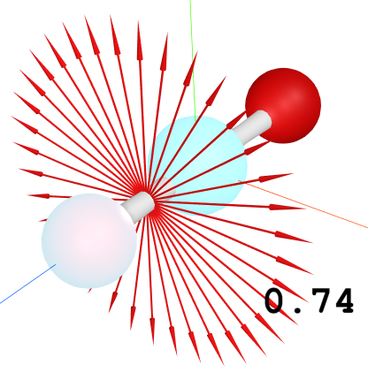

# 键の性质

## 各种键级

### 基础键级

#### Mayer

$$
I_{a,b}=\sum_{\mu \in a}\sum_{\nu \in b}(DS)_{\mu \nu}(DS)_{\nu \mu}
$$

#### Wiberg

$$
I_{a,b}=\sum _{\mu \in a}\sum _{\nu \in b}P_{\mu \nu}^2
$$

$$
P=S^{\frac{1}{2}}DS^{\frac{1}{2}}
$$

其中P为使用lowdin正交化得到的正交基下的密度矩阵

### 轨道键级

> 计算某个分子轨道的键级

可以根据该值的正负来判断该分子轨道中两个原子之间是成键还是反键轨道。

需要在`实空间函数/分子轨道`中选择一个分子轨道：`{obt}`

### π键级(pocv)

使用pocv方法修改分子轨道之后带入基础键级公式计算得到

### π键级(mocv)

使用mocv方法修改分子轨道之后带入基础键级公式计算得到

### 环轴(pocv)

指定方向为垂直于键轴的方向，使用pocv方法修改分子轨道后带入基础键级公式计算得到

下图是CO2分子的环轴键级，其每个方向的大小都相同，都是0.74

### 环轴(mocv)

指定方向为垂直于键轴的方向，使用mocv方法修改分子轨道后带入基础键级公式计算得到

### 束缚键级

> 何谓束缚键级？选中原子在特定方向的p轨道及其价层s轨道与周围邻接原子所有轨道之间重叠所成键级

计算束缚键级的时候需要选择一个原子，会计算出与该原子相邻的束缚键级

原理：使用pocv方法，将所选原子的p轨道投影到指定方向上，其他原子的原子轨道保持不变，然后带入键级计算公式计算
